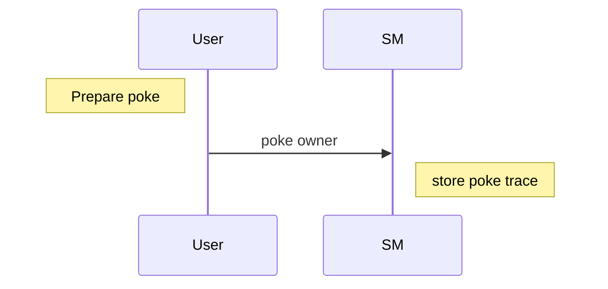

## :round_pushpin: [See Github version and full code here](https://github.com/marigold-dev/training-dapp-1)

# Training dapp n°1

# :point_up: Poke game

> dapp : A decentralized application (dApp) is a type of distributed open source software application that runs on a peer-to-peer (P2P) blockchain network rather than on a single computer. DApps are visibly similar to other software applications that are supported on a website or mobile device but are P2P supported

We are creating a poke game on smart contract. You will learn :

- create a Tezos project with taqueria
- create a smart contract in jsligo
- deploy the smart contract to a local testnet and a real testnet
- create a dapp using taquito library and interact with a Tezos browser wallet
- use an indexer

> :warning: This is not an HTML or REACT training, I will avoid as much of possible any complexity relative to these technologies

The game consists on poking the owner of a smart contract. The smartcontract keeps a track of user interactions and stores this trace.

Poke sequence diagram



# :memo: Prerequisites

Please install this software first on your machine or use online alternative :

- [ ] [VS Code](https://code.visualstudio.com/download) : as text editor
- [ ] [npm](https://nodejs.org/en/download/) : we will use a typescript React client app
- [ ] [yarn](https://classic.yarnpkg.com/lang/en/docs/install/#windows-stable) : because yet another package manager (https://www.geeksforgeeks.org/difference-between-npm-and-yarn/)
- [ ] [taqueria v0.37.0](https://github.com/ecadlabs/taqueria) : Tezos Dapp project tooling
- [ ] [taqueria VS Code extension](https://marketplace.visualstudio.com/items?itemName=ecadlabs.taqueria-vscode) : visualize your project and execute tasks
- [ ] [ligo VS Code extension](https://marketplace.visualstudio.com/items?itemName=ligolang-publish.ligo-vscode) : for smart contract highlighting, completion, etc ..
- [ ] [Temple wallet](https://templewallet.com/) : an easy to use Tezos wallet in your browser (but you can take any other one that supports ghostnet)
- [ ] [Docker](https://docs.docker.com/engine/install/) you cannot do anything without containers today ...

> :warning: :whale: About Taqueria : taqueria is using software images from Docker to run Ligo, etc ... Docker should be running on your machine :whale2:

# :scroll: Smart contract

## Step 1 : Create folder & file

> Note : We will use CLI here but you can also use GUI from the IDE or Taqueria plugin

```bash
taq init training
cd training
taq install @taqueria/plugin-ligo
taq create contract pokeGame.jsligo
```

## Step 2 : Edit pokeGame.jsligo

Remove the default code and paste this code instead

```ligolang
type storage = unit;
type return_ = [list<operation>, storage];

@entry
const poke = ( _ : unit , store: storage): return_ => {
  return [list([]) as list<operation>, store];
};
```

Every contract requires to respect this convention :

- at least one entrypoint, prefixed by **//@entry** annotation, with a mandatory signature taking (parameter, storage) and a return type :
  - **parameter** : the entrypoint `parameter`. It can be whatever type (here for example of type `unit`)
  - **storage** : the on-chain storage (can be any type, here `unit` by default)
  - **return\_** : a list of `operation` and a storage

> [Click here to see the Entrypoints contracts documentation](https://ligolang.org/docs/advanced/entrypoints-contracts)>

> Note : The old syntax was requiring a main function. It is still valid but very verbatim
>
> `Poke` will be generated from `poke` entrypoint and will generate a `variant` type under the hood. It is a bit equivalent of Enum type in javascript. For each entries, a variant case will be added to the global parameter, here is kinda what intermediate state will produce (also a default main function will be generated too, you don't have to think about it anymore) :
>
> ```ligolang
> type all_parameters = |["Poke"];
>
> ...
>
> const main = ([action, store]: [all_parameters, storage]): return_ => {
>  return match(action, {
>    Poke: (args) => poke(args,store),
>  });
> };
> ```

> [Click here to understand the variant type](https://ligolang.org/docs/language-basics/unit-option-pattern-matching#variant-types)

## Step 3 : Write the poke function

We want to store every caller address poking the contract. Let's redefine storage, and then add the caller to the set of poke guys

At line 1, replace :

```ligolang
type storage = set<address>;
```

change poke function to :

```ligolang
@entry
const poke = ( _ : unit , store: storage): return_ => {
  return [list([]) as list<operation>, Set.add(Tezos.get_source(), store)];
};
```

Set library has specific usage :

> [Click here to see Set library documentation](https://ligolang.org/docs/language-basics/sets-lists-tuples#sets)

Here, we get the caller address using `Tezos.get_source()`. Tezos library provides useful function for manipulating blockchain objects

> [Click here to see Tezos library documentation](https://ligolang.org/docs/reference/current-reference)

## Step 4 : Try to poke

The LIGO command-line interpreter provides sub-commands to directly test your LIGO code

> [Click here to see Testing documentation](https://ligolang.org/docs/advanced/testing)

Compile contract (to check any error, and prepare the michelson outputfile to deploy later) :

```bash
TAQ_LIGO_IMAGE=ligolang/ligo:0.72.0 taq compile pokeGame.jsligo
```

Taqueria is creating the Michelson file output on `artifacts` folder

To compile an initial storage with taqueria, edit the new file `pokeGame.storageList.jsligo`

Replace current code by

```ligolang
#import "pokeGame.jsligo" "Contract"

const default_storage = Set.empty as set<address>;
```

Compile all now

```bash
TAQ_LIGO_IMAGE=ligolang/ligo:0.72.0 taq compile pokeGame.jsligo
```

It compiles both source code and storage now. (You can also pass an argument -e to change the environment target for your storage initialization)

Let's simulate the Poke call using `taq simulate`  
We will pass the contract parameter `unit` and the initial on-chain storage with an empty set

Edit the new file `pokeGame.parameterList.jsligo`

```ligolang
#import "pokeGame.jsligo" "Contract"
const default_parameter: parameter_of Contract = Poke();
```

Run simulation now (you will need tezos client plugin for simulation)

```bash
taq install @taqueria/plugin-tezos-client
TAQ_LIGO_IMAGE=ligolang/ligo:0.73.0 taq compile pokeGame.jsligo
TAQ_TEZOS_CLIENT_IMAGE=tezos/tezos:v17.2 taq simulate pokeGame.tz --param pokeGame.parameter.default_parameter.tz
```

Output should give :

```logs
┌─────────────┬──────────────────────────────────────────────┐
│ Contract    │ Result                                       │
├─────────────┼──────────────────────────────────────────────┤
│ pokeGame.tz │ storage                                      │
│             │   { "tz1Ke2h7sDdakHJQh8WX4Z372du1KChsksyU" } │
│             │ emitted operations                           │
│             │                                              │
│             │ big_map diff                                 │
│             │                                              │
│             │                                              │
└─────────────┴──────────────────────────────────────────────┘
```

You can notice that the instruction will store the address of the caller into the traces storage

## Step 5 : Configure your wallet to get free Tez

### Local testnet wallet

Flextesa local testnet includes already some accounts with XTZ (alice,bob,...), so you don't really need to configure something. Anyway, we will not use local testnet and deploy directly to the ghostnet

### Ghostnet testnet wallet

:warning: Taqueria will require an account (mainly to deploy your contract), the first time you will try to deploy a contract it will generate a new implicit account you will have to fill with XTZ

Force Taqueria to generate this account

```bash
taq install @taqueria/plugin-taquito
taq deploy pokeGame.tz -e "testing"
```

You should get this kind of log

```log
Warning: the faucet field in network configs has been deprecated and will be ignored
A keypair with public key hash tz1XXXXXXXXXXXXXXXXXXXXXX was generated for you.
To fund this account:
1. Go to https://teztnets.xyz and click "Faucet" of the target testnet
2. Copy and paste the above key into the 'wallet address field
3. Request some Tez (Note that you might need to wait for a few seconds for the network to register the funds)
No operations performed
```

#### Choice 1 : use alice wallet everywhere

Set alice as taqueria operator

Edit `.taq/config.local.testing.json`

```json
{
  "networkName": "ghostnet",
  "accounts": {
    "taqOperatorAccount": {
      "publicKey": "edpkvGfYw3LyB1UcCahKQk4rF2tvbMUk8GFiTuMjL75uGXrpvKXhjn",
      "publicKeyHash": "tz1VSUr8wwNhLAzempoch5d6hLRiTh8Cjcjb",
      "privateKey": "edsk3QoqBuvdamxouPhin7swCvkQNgq4jP5KZPbwWNnwdZpSpJiEbq"
    }
  }
}
```

#### Choice 2 : use the Taqueria generated account instead

Look at `.taq/config.local.testing.json` file to get the `privateKey`

#### Configure Temple

Open your Temple browser extension or on your mobile phone. Do the initial setup.
Once you are done, go to Settings (click on the avatar icon, or display Temple in full page) and click on `Import account` > `Private key` tab

Copy the `privateKey` from alice (or generated taqueria account) and paste it to Temple text input

#### Send free XTZ to your account

If you don't have enough XTZ to start, go to a web faucet like [Marigold faucet here](https://faucet.marigold.dev/).
Connect your wallet on `Ghostnet` and ask for free `XTZ`

Now you have :moneybag: !!!

## Step 6 : Deploy to Ghostnet testnet

Retry to deploy to testing env

```bash
taq deploy pokeGame.tz -e "testing"
```

HOORAY :confetti_ball: your smart contract is ready on the Ghostnet !

```logs
┌─────────────┬──────────────────────────────────────┬──────────┬──────────────────┬────────────────────────────────┐
│ Contract    │ Address                              │ Alias    │ Balance In Mutez │ Destination                    │
├─────────────┼──────────────────────────────────────┼──────────┼──────────────────┼────────────────────────────────┤
│ pokeGame.tz │ KT1SVwMCVR9T3nq1sRsULy2uYaBRG1nqT9rz │ pokeGame │ 0                │ https://ghostnet.ecadinfra.com │
└─────────────┴──────────────────────────────────────┴──────────┴──────────────────┴────────────────────────────────┘
```

# :construction_worker: Dapp

## Step 1 : Create a react app

```bash
yarn create vite
```

Then follow the prompts. Choose React and then Typescript:

```shell
? Project name: › app #Enter your project name

? Select a framework: › - Use arrow-keys. Return to submit. #We select React as framework
    Vanilla
    Vue
❯   React
    Preact
    Lit
    Svelte
    Others

? Select a variant: › - Use arrow-keys. Return to submit. #Both TypeScript variants are fine. We select TypeScript only.
    TypeScript
❯   TypeScript + SWC
    JavaScript
    JavaScript + SWC

cd app
```

SWC is not part of this tutorial but you can read about it here [SWC](https://swc.rs/).

Add taquito, tzkt indexer lib

```bash
yarn add @taquito/taquito @taquito/beacon-wallet @airgap/beacon-sdk  @tzkt/sdk-api
yarn add -D @airgap/beacon-types
```

> :warning: :warning: :warning: Before we start we need to add the following dependencies in order to not get polyfill issues. The reason for this step is that certain required dependencies are Node APIs, thus not included in Browsers. But still needed for communication and interaction with Wallets and Smart Contracts.

> For example, in my case, I installed this :
>
> ```bash
> yarn add --dev process buffer crypto-browserify stream-browserify assert stream-http https-browserify os-browserify url path-browserify
> ```
>
> then create a new file `nodeSpecific.ts` in the src folder of your project and edit with this content :
>
> ```bash
> touch src/nodeSpecific.ts
> ```
>
> ```js
> import { Buffer } from "buffer";
>
> globalThis.Buffer = Buffer;
> ```
>
> then open the `index.html` file and add the following script in the body. It should look like this :
>
> ```html
> <body>
>   <div id="root"></div>
>   <script type="module" src="/src/nodeSpecific.ts"></script>
>   <script type="module" src="/src/main.tsx"></script>
> </body>
> ```
>
> Finally open the `vite.config.ts` file and edit it with this content :
>
> ```js
> import { defineConfig } from "vite";
> import react from "@vitejs/plugin-react-swc";
>
> // https://vitejs.dev/config/
> export default defineConfig({
>   define: {
>     global: {},
>   },
>   plugins: [react()],
>   resolve: {
>     alias: {
>       stream: "stream-browserify",
>       os: "os-browserify/browser",
>       util: "util",
>       process: "process/browser",
>       buffer: "buffer",
>     },
>   },
> });
> ```

### Generate Typescript classes from Michelson code

Taqueria is able to generate Typescript classes for our React application. It will take the definition of your smart contract and generate the contract entrypoint functions, type definitions, etc ...

To get typescript classes from taqueria plugin, get back to root folder running :

```bash
cd ..
taq install @taqueria/plugin-contract-types
taq generate types ./app/src
cd ./app
```

Now you can run the dev server

```bash
yarn dev
```

Open your browser at : http://localhost:5173/
Your app should be running

## Step 2 : Connect / disconnect the wallet

We will declare 2 React Button components and a display of address and balance while connected

Edit `src/App.tsx` file

```typescript
import { NetworkType } from "@airgap/beacon-types";
import { BeaconWallet } from "@taquito/beacon-wallet";
import { TezosToolkit } from "@taquito/taquito";
import * as api from "@tzkt/sdk-api";
import { useEffect, useState } from "react";
import "./App.css";
import ConnectButton from "./ConnectWallet";
import DisconnectButton from "./DisconnectWallet";

function App() {
  api.defaults.baseUrl = "https://api.ghostnet.tzkt.io";

  const Tezos = new TezosToolkit("https://ghostnet.tezos.marigold.dev");
  const wallet = new BeaconWallet({
    name: "Training",
    preferredNetwork: NetworkType.GHOSTNET,
  });
  Tezos.setWalletProvider(wallet);

  useEffect(() => {
    (async () => {
      const activeAccount = await wallet.client.getActiveAccount();
      if (activeAccount) {
        setUserAddress(activeAccount.address);
        const balance = await Tezos.tz.getBalance(activeAccount.address);
        setUserBalance(balance.toNumber());
      }
    })();
  }, []);

  const [userAddress, setUserAddress] = useState<string>("");
  const [userBalance, setUserBalance] = useState<number>(0);

  return (
    <div className="App">
      <header className="App-header">
        <ConnectButton
          Tezos={Tezos}
          setUserAddress={setUserAddress}
          setUserBalance={setUserBalance}
          wallet={wallet}
        />

        <DisconnectButton
          wallet={wallet}
          setUserAddress={setUserAddress}
          setUserBalance={setUserBalance}
        />

        <div>
          I am {userAddress} with {userBalance} mutez
        </div>
      </header>
    </div>
  );
}

export default App;
```

Let's create the 2 missing src component files and put code in it. On `src` folder, create these files.

```bash
touch src/ConnectWallet.tsx
touch src/DisconnectWallet.tsx
```

ConnectWallet button will create an instance wallet, get user permissions via a popup and then retrieve account information

Edit ConnectWallet.tsx

```typescript
import { NetworkType } from "@airgap/beacon-sdk";
import { BeaconWallet } from "@taquito/beacon-wallet";
import { TezosToolkit } from "@taquito/taquito";
import { Dispatch, SetStateAction } from "react";

type ButtonProps = {
  Tezos: TezosToolkit;
  setUserAddress: Dispatch<SetStateAction<string>>;
  setUserBalance: Dispatch<SetStateAction<number>>;
  wallet: BeaconWallet;
};

const ConnectButton = ({
  Tezos,
  setUserAddress,
  setUserBalance,
  wallet,
}: ButtonProps): JSX.Element => {
  const connectWallet = async (): Promise<void> => {
    try {
      await wallet.requestPermissions({
        network: {
          type: NetworkType.GHOSTNET,
          rpcUrl: "https://ghostnet.tezos.marigold.dev",
        },
      });
      // gets user's address
      const userAddress = await wallet.getPKH();
      const balance = await Tezos.tz.getBalance(userAddress);
      setUserBalance(balance.toNumber());
      setUserAddress(userAddress);
    } catch (error) {
      console.log(error);
    }
  };

  return (
    <div className="buttons">
      <button className="button" onClick={connectWallet}>
        <span>
          <i className="fas fa-wallet"></i>&nbsp; Connect with wallet
        </span>
      </button>
    </div>
  );
};

export default ConnectButton;
```

DisconnectWallet button will clean wallet instance and all linked objects

```typescript
import { BeaconWallet } from "@taquito/beacon-wallet";
import { Dispatch, SetStateAction } from "react";

interface ButtonProps {
  wallet: BeaconWallet;
  setUserAddress: Dispatch<SetStateAction<string>>;
  setUserBalance: Dispatch<SetStateAction<number>>;
}

const DisconnectButton = ({
  wallet,
  setUserAddress,
  setUserBalance,
}: ButtonProps): JSX.Element => {
  const disconnectWallet = async (): Promise<void> => {
    setUserAddress("");
    setUserBalance(0);
    console.log("disconnecting wallet");
    await wallet.clearActiveAccount();
  };

  return (
    <div className="buttons">
      <button className="button" onClick={disconnectWallet}>
        <i className="fas fa-times"></i>&nbsp; Disconnect wallet
      </button>
    </div>
  );
};

export default DisconnectButton;
```

Save both file, the dev server should refresh the page

As Temple is configured well, Click on Connect button

On the popup, select your Temple wallet, then your account and connect.


:confetti_ball: your are "logged"

Click on the Disconnect button (if you want to test it too)

## Step 3 : List poke contracts via an indexer

Remember that you deployed your contract previously.
Instead of querying heavily the rpc node to search where is located your contract and get back some information about it, we can use an indexer. We can consider it as an enriched cache API on top of rpc node. In this example, we will use the tzkt indexer

[Install jq](https://github.com/stedolan/jq)

On `package.json`, change the `start script` line, prefixing with `jq` command to create an new env var pointing to your last smart contract address on testing env :

```bash
    "dev": "jq -r '\"VITE_CONTRACT_ADDRESS=\" + last(.tasks[]).output[0].address' ../.taq/testing-state.json > .env && vite",
```

You are pointing now to the last contract deployed on Ghostnet by taqueria

We will add a button to fetch all similar contracts to the one you deployed, then we display the list

Now, edit `App.tsx` , before the `return` , add this section for the fetch

```typescript
const [contracts, setContracts] = useState<Array<api.Contract>>([]);

const fetchContracts = () => {
  (async () => {
    setContracts(
      await api.contractsGetSimilar(import.meta.env.VITE_CONTRACT_ADDRESS, {
        includeStorage: true,
        sort: { desc: "id" },
      })
    );
  })();
};
```

On the return 'html templating' section, add this after the display of the user balance div `I am {userAddress} with {userBalance} mutez`, add this :

```typescript
<br />
<div>
  <button onClick={fetchContracts}>Fetch contracts</button>
  {contracts.map((contract) =>
  <div>{contract.address}</div>
  )}
</div>
```

Save your file, and **re-run** your server , it will generate the .env file containing the last deployed contracts :)

```bash
yarn dev
```

Go to the browser. click on `Fetch contracts` button


:confetti_ball: Congrats ! you are able to list all similar deployed contracts

## Step 4 : Poke your contract

Add this import and this new function inside the App function, it will call the entrypoint to poke

```typescript
import { PokeGameWalletType } from "./pokeGame.types";
```

```typescript
const poke = async (contract: api.Contract) => {
  let c: PokeGameWalletType = await Tezos.wallet.at<PokeGameWalletType>(
    "" + contract.address
  );
  try {
    const op = await c.methods.default().send();
    await op.confirmation();
    alert("Tx done");
  } catch (error: any) {
    console.table(`Error: ${JSON.stringify(error, null, 2)}`);
  }
};
```

> :warning: Normally we should call `c.methods.poke()` function , but with a unique entrypoint, Michelson is required a unique `default` name instead of having the name of the function. Also be careful because all entrypoints naming are converting to lowercase whatever variant variable name you can have on source file.

Then replace the line displaying the contract address `{contracts.map((contract) => <div>{contract.address}</div>)}` by this one that will add a Poke button

```html
    {contracts.map((contract) => <div>{contract.address} <button onClick={() =>poke(contract)}>Poke</button></div>)}
```

Save and see the page refreshed, then click on Poke button


:confetti_ball: If you have enough Tz on your wallet for the gas, then it should have successfully call the contract and added you to the list of poke guyz

## Step 5 : Display poke guys

To verify that on the page, we can display the list of poke guyz directly on the page

Replace again the html contracts line `{contracts ...}` by this one

```html
<table><thead><tr><th>address</th><th>people</th><th>action</th></tr></thead><tbody>
    {contracts.map((contract) => <tr><td style={{borderStyle: "dotted"}}>{contract.address}</td><td style={{borderStyle: "dotted"}}>{contract.storage.join(", ")}</td><td style={{borderStyle: "dotted"}}><button onClick={() =>poke(contract)}>Poke</button></td></tr>)}
    </tbody></table>
```

Contracts are displaying its people now


> :information_source: Wait around few second for blockchain confirmation and click on `fetch contracts` to refresh the list

:confetti_ball: Congratulation, you have completed this first dapp training

# :palm_tree: Conclusion :sun_with_face:

Now, you are able to create any Smart Contract using Ligo and create a complete Dapp via Taqueria/Taquito.

On next training, you will learn how to call a Smart contract inside a Smart Contract and use the callback, write unit test, etc ...

[:arrow_right: NEXT (HTML version)](https://marigold-dev.github.io/training-dapp-2)

[:arrow_right: NEXT (Github version)](https://github.com/marigold-dev/training-dapp-2)
