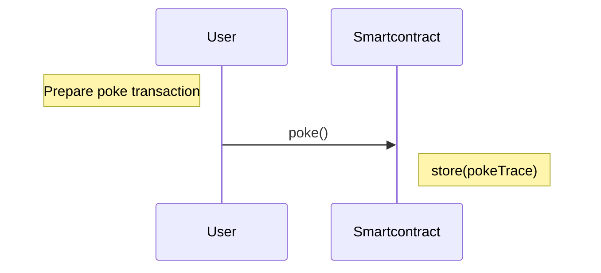

> dApp : A decentralized application is a type of distributed open source software application that runs on a peer-to-peer (P2P) blockchain network rather than on a single computer. DApps are visibly similar to other software applications that are supported on a website or mobile device.

This tutorial shows you how to create a Poke game as a smart contract.
The game consists of poking the owner of a smart contract. The smart contract keeps track of user interactions and stores a trace.

Poke sequence diagram.



You will learn :

- How to create a Tezos project with Taqueria.
- How to create a smart contract in jsLigo.
- How to deploy the smart contract a real testnet named Ghostnet.
- How to create a frontend dApp using Taquito library and interact with a Tezos browser wallet.
- How to use an indexer like TZKT.

## Prerequisites

This tutorial uses Typescript, so it will be easier if you are familiar with JavaScript.

1. Make sure that you have installed these tools:

   - [Node.JS and NPM](https://nodejs.org/en/download/): NPM is required to install the web application's dependencies.
   - [Taqueria](https://taqueria.io/), version 0.45.0 or later: Taqueria is a platform that makes it easier to develop and test dApps.
   - [Docker](https://docs.docker.com/engine/install/): Docker is required to run Taqueria.
   - [jq](https://stedolan.github.io/jq/download/): Some commands use the `jq` program to extract JSON data.
   - [`yarn`](https://yarnpkg.com/): The frontend application uses yarn to build and run (see this article for details about [differences between `npm` and `yarn`](https://www.geeksforgeeks.org/difference-between-npm-and-yarn/)).
   - Any Tezos-compatible wallet that supports Ghostnet, such as [Temple wallet](https://templewallet.com/).

2. Optionally, you can install [`VS Code`](https://code.visualstudio.com/download) to edit your application code and the [LIGO VS Code extension](https://marketplace.visualstudio.com/items?itemName=ligolang-publish.ligo-vscode) for LIGO editing features such as code highlighting and completion.
   Taqueria also provides a [Taqueria VS Code extension](https://marketplace.visualstudio.com/items?itemName=ecadlabs.taqueria-vscode) that helps visualize your project and run tasks.

## The tutorial application

In this tutorial, you create a simple game where the user is poking through a dApp. The user interacts with the smart contract through a web interface, where they can see the current state of the contract and send poke commands to it. The contract responds by updating its storage with the user's address. Alternatively, a user can also poke the contract deployed by other users.

The application looks like this:


The code for the completed application is in this GitHub repository: [solution](https://github.com/marigold-dev/training-dapp-1/tree/main/solution)

When you're ready, move to the next section [Create your minimum dApp on Tezos](./dapp/part-1) to begin setting up the application.

---

title: 'Part 1: Create your minimum dApp on Tezos'
authors: 'Benjamin Fuentes (Marigold)'
last_update:
date: 22 May 2024

---

To start working with the application, you create a Taqueria project and use it to deploy the Poke contract.
Then you set up a web application to connect with a wallet, and then interact with your smart contract.

Before you begin, make sure that you have installed the tools in the [Prerequisites](../dapp#prerequisites) section.

## Creating a Taqueria project

Taqueria manages the project structure and keeps it up to date.
For example, when you deploy a new smart contract, Taqueria automatically updates the web app to send transactions to that new smart contract.
Follow these steps to set up a Taqueria project:

On the command-line terminal, run these commands to set up a Taqueria project and install the LIGO and Taquito plugins:

```bash
taq init training
cd training
taq install @taqueria/plugin-ligo
taq install @taqueria/plugin-taquito
taq create contract pokeGame.jsligo
```

## Write the smart contract

1. Edit the **pokeGame.jsligo** file. Remove the default code and paste this code instead.

   ```jsligo
   export type storage = unit;

   type return_ = [list<operation>, storage];

   @entry
   const poke = (_: unit, store: storage): return_ => {
     return [list([]), store];
   };
   ```

   Every contract has to follow these rules :

   - At least one entrypoint, annotated with **@entry** , with a mandatory signature taking 2 arguments **\*(parameter, storage)** and a return type. An entrypoint is a function that is exposed as an external API.
     - **parameter**: the entrypoint parameter. Mandatory and can be of any type. For example: an (ignored) variable starting with`_` here, and of type `unit` (the type void on LIGO).
     - **storage**: the on-chain storage. Mandatory and can be of any type. For example, here we use the type `unit`. It is recommended to add an `export` keyword before the type definition as it is a good practice to export it when you are required to write unit tests from another LIGO file.
     - **return\_**: a mandatory pair of list of `operation` and the storage type (defined earlier). Return type naming is free but don't use an existing keyword like **return**.

   [Have a look at the Entrypoints contracts documentation](/smart-contracts/entrypoints)>

   > Note: Previous versions of LIGO used a single main function instead of a function for each entrypoint. This syntax is still valid, but it is harder to read and deprecated in LIGO V1.
   >
   > A `Poke` variant parameter is generated from the `poke` entrypoint function under the hood. A variant is more or less equivalent of the Enum type in Javascript. A default main function is generated and act like as a dispatcher for each of your entrypoints. It means that this painful boilerplate is no more needed on the new syntax.

   [Have a look at the Variant type documentation](/smart-contracts/data-types/complex-data-types#variants)

1. Write the poke function.
   The objective is to store every user/caller addresses poking the contract.
   Rewrite the storage, and add the caller address to the set of traces.

   At line 1, replace the line with:

   ```jsligo
   export type storage = set<address>;
   ```

1. Replace the `poke` function with:

   ```jsligo
   @entry
   const poke = (_: unit, store: storage): return_ => {
     return [list([]), Set.add(Tezos.get_source(), store)]
   };
   ```

   Explanation:

   - The LIGO Set library has a function **add** to add one element to the Set of items. There is no concept of Class in LIGO, you use a library to apply functions on objects.
   - A list of operations is required to return. An empty list is returned here as there is no other contract to call.

   [Have a look at the Set library documentation](https://ligolang.org/docs/language-basics/sets-lists-tuples#sets)

   [Have a look at the List library documentation](https://ligolang.org/docs/language-basics/sets-lists-tuples/?lang=jsligo#lists)

   Here, get the caller address using `Tezos.get_source()`. Tezos library provides useful functions for manipulating blockchain objects.

   [Have a look at the Tezos library documentation](https://ligolang.org/docs/reference/current-reference)

## Simulate a call on your smart contract

The LIGO command-line provides sub-commands to test your Ligo code.

[Have a look at the Testing Framework documentation](https://ligolang.org/docs/advanced/testing)

1. Compile the contract with Taqueria (Force to use a specific LIGO version with `TAQ_LIGO_IMAGE` Taqueria environment variable).

```bash
TAQ_LIGO_IMAGE=ligolang/ligo:1.6.0 taq compile pokeGame.jsligo
```

Taqueria is generating the `.tz` Michelson file in the `artifacts`` folder. The Michelson language is the default stack language used by the Michelson VM to run your code on a node. It is something similar to WASM.

[Have a look on the Michelson documentation](https://tezos.gitlab.io/active/michelson.html)

1. Taqueria is generating two additional files, edit the first file `pokeGame.storageList.jsligo` replacing the current code with:

   ```jsligo
   #import "pokeGame.jsligo" "Contract"

   const default_storage = Set.empty as set<address>;
   ```

   When you deploy a contract, you are required to initialize the default state of your smart contract. Taqueria allows you to declare different variables on this file, it is useful to use different initialized states per environment.

   [Have a look at the Taqueria documentation](https://taqueria.io/docs/plugins/plugin-ligo/#the-taq-compile-task)

1. Compile all (contract + initial storage)

   ```bash
   TAQ_LIGO_IMAGE=ligolang/ligo:1.6.0 taq compile pokeGame.jsligo
   ```

   It compiles both source code and storage.

   Before deployment, to simulate a call to our entrypoint **poke**, Taq has a **taq simulate** command.  
   The contract parameter `Poke()` and the initial storage with the default empty set are passed to the execution.

1. Edit the second file **pokeGame.parameterList.jsligo**

   ```jsligo
   #import "pokeGame.jsligo" "Contract"
   const default_parameter: parameter_of Contract = Poke();
   ```

1. Run the simulation. First, install the Tezos client plugin, recompile it all, and then run the simulation.

   ```bash
   taq install @taqueria/plugin-octez-client
   TAQ_LIGO_IMAGE=ligolang/ligo:1.6.0 taq compile pokeGame.jsligo
   taq simulate pokeGame.tz --param pokeGame.parameter.default_parameter.tz
   ```

   Output logs:

   ```logs
   ┌─────────────┬──────────────────────────────────────────────┐
   │ Contract    │ Result                                       │
   ├─────────────┼──────────────────────────────────────────────┤
   │ pokeGame.tz │ storage                                      │
   │             │   { "tz1Ke2h7sDdakHJQh8WX4Z372du1KChsksyU" } │
   │             │ emitted operations                           │
   │             │                                              │
   │             │ big_map diff                                 │
   │             │                                              │
   │             │                                              │
   └─────────────┴──────────────────────────────────────────────┘
   ```

   You can notice that the instruction is storing the address of the caller in the storage set.

### Configure your wallet and deploy

The default Tezos testing testnet is called **Ghostnet**.

> :warning: You need an account to deploy a contract with some `tez` (the Tezos native currency). The first time you deploy a contract with Taqueria, it is generating a new implicit account with `0 tez`.

1. Deploy your contract to the `testing` environment. Ut forces Taqueria to generate a default account on a testing config file.

   ```bash
   taq deploy pokeGame.tz -e "testing"
   ```

   You should get this kind of log.

   ```log
   Warning: the faucet field in network configs has been deprecated and will be ignored.
   A keypair with public key hash tz1XXXXXXXXXXXXXXXXXXXXXX was generated for you.
   To fund this account:
   1. Go to https://teztnets.com and click "Faucet" of the target testnet.
   2. Copy and paste the above key into the 'wallet address field.
   3. Request some Tez (Note that you might need to wait for a few seconds for the network to register the funds).
   No operations performed.
   ```

   - Choice N°1 (Recommended): Use Alice wallet instead of the generated account. A common usage is to use **alice** account as Taqueria operator. **alice** is a commonly known address used on Tezos and she has always some **tez**. Replace the Taqueria config file for **testing** env **.taq/config.local.testing.json** with **alice** settings:

     ```json
     {
       "networkName": "ghostnet",
       "accounts": {
         "taqOperatorAccount": {
           "publicKey": "edpkvGfYw3LyB1UcCahKQk4rF2tvbMUk8GFiTuMjL75uGXrpvKXhjn",
           "publicKeyHash": "tz1VSUr8wwNhLAzempoch5d6hLRiTh8Cjcjb",
           "privateKey": "edsk3QoqBuvdamxouPhin7swCvkQNgq4jP5KZPbwWNnwdZpSpJiEbq"
         }
       }
     }
     ```

   - Choice N°2: use the Taqueria-generated account. Copy the account **privateKey** from the **.taq/config.local.testing.json** config file. Open your Temple browser extension on your computer or on your mobile phone and do the [initial setup](https://www.youtube.com/watch?v=S8_tL8PfCts). Once you are done, go to Settings (click on the avatar icon, or display Temple in full page) and click on **Import account > Private key** tab. Paste the **privateKey** to Temple text input and confirm. Send free Tez to your new account via this web faucet [here](https://teztnets.com/). Connect your wallet on **Ghostnet** and ask for free tez.

   Now you have some money to play with.

1. Deploy to Ghostnet testnet.

   ```bash
   taq deploy pokeGame.tz -e "testing"
   ```

   Your smart contract is deployed on the Ghostnet.

   ```logs
   ┌─────────────┬──────────────────────────────────────┬──────────┬──────────────────┬────────────────────────────────┐
   │ Contract    │ Address                              │ Alias    │ Balance In Mutez │ Destination                    │
   ├─────────────┼──────────────────────────────────────┼──────────┼──────────────────┼────────────────────────────────┤
   │ pokeGame.tz │ KT1G8tx4qSeJmKRY1p2oxA6eYoCGc9Qi3Fky │ pokeGame │ 0                │ https://ghostnet.ecadinfra.com │
   └─────────────┴──────────────────────────────────────┴──────────┴──────────────────┴────────────────────────────────┘
   ```

## Create the frontend

### Create a React app

```bash
yarn create vite
```

Then follow the prompts. Choose React and then Typescript+SWC:

```shell
? Project name: › app #Enter your project name

? Select a framework: › - Use arrow-keys. Return to submit. # Select React as framework
    Vanilla
    Vue
❯   React
    Preact
    Lit
    Svelte
    Others

? Select a variant: › - Use arrow-keys. Return to submit. #Both TypeScript variants are fine. Select TypeScript only.
    TypeScript
❯   TypeScript + SWC
    JavaScript
    JavaScript + SWC
```

[More information about SWC here](https://swc.rs/).

1. Add taquito and tzkt indexer libraries.

   ```bash
   cd app
   yarn add @taquito/taquito @taquito/beacon-wallet @airgap/beacon-sdk  @tzkt/sdk-api
   yarn add -D @airgap/beacon-types
   ```

   > :warning: Before starting, add the following dependencies in order to resolve polyfill issues. Some dependencies are from NodeJs, thus not included in browsers.

1. For example, in my case, I installed this:

   ```bash
   yarn add --dev process buffer crypto-browserify stream-browserify assert stream-http https-browserify os-browserify url path-browserify
   ```

1. Create a new file `nodeSpecific.ts` in the src folder of your project and edit with this content:

   ```bash
   touch src/nodeSpecific.ts
   ```

   ```js
   import { Buffer } from "buffer";

   globalThis.Buffer = Buffer;
   ```

1. Open the `index.html` file and replace the `body` with this one:

   ```html
   <body>
     <div id="root"></div>
     <script type="module" src="/src/nodeSpecific.ts"></script>
     <script type="module" src="/src/main.tsx"></script>
   </body>
   ```

1. Open the `vite.config.ts` file and replace it with:

   ```js
   import react from "@vitejs/plugin-react-swc";
   import path from "path";
   import { defineConfig } from "vite";
   // https://vitejs.dev/config/
   export default ({ command }) => {
     const isBuild = command === "build";

     return defineConfig({
       define: {},
       plugins: [react()],
       build: {
         commonjsOptions: {
           transformMixedEsModules: true,
         },
       },
       resolve: {
         alias: {
           // dedupe @airgap/beacon-sdk
           // I almost have no idea why it needs `cjs` on dev and `esm` on build, but this is how it works 🤷‍♂️
           "@airgap/beacon-sdk": path.resolve(
             path.resolve(),
             `./node_modules/@airgap/beacon-sdk/dist/${
               isBuild ? "esm" : "cjs"
             }/index.js`
           ),
           stream: "stream-browserify",
           os: "os-browserify/browser",
           util: "util",
           process: "process/browser",
           buffer: "buffer",
           crypto: "crypto-browserify",
           assert: "assert",
           http: "stream-http",
           https: "https-browserify",
           url: "url",
           path: "path-browserify",
         },
       },
     });
   };
   ```

### Generate the Typescript classes from Michelson code and run the server

Taqueria is able to generate Typescript classes for any frontend application. It takes the definition of your smart contract and generates the contract entrypoint functions, type definitions, etc ...

To get typescript classes from Taqueria plugin, on your project root folder run:

```bash
taq install @taqueria/plugin-contract-types
taq generate types ./app/src
```

1. Back to your frontend app, and run the dev server.

   ```bash
   cd app
   yarn dev
   ```

1. Open your browser at: http://localhost:5173/
   Your app should be running.

### Connect / disconnect the wallet

Declare two React Button components and display the user's address and his balance.

Edit **src/App.tsx** file.

```typescript
import { NetworkType } from "@airgap/beacon-types";
import { BeaconWallet } from "@taquito/beacon-wallet";
import { TezosToolkit } from "@taquito/taquito";
import * as api from "@tzkt/sdk-api";
import { useEffect, useState } from "react";
import "./App.css";
import ConnectButton from "./ConnectWallet";
import DisconnectButton from "./DisconnectWallet";

function App() {
  api.defaults.baseUrl = "https://api.ghostnet.tzkt.io";

  const [Tezos, setTezos] = useState<TezosToolkit>(
    new TezosToolkit("https://ghostnet.ecadinfra.com")
  );
  const [wallet, setWallet] = useState<BeaconWallet>(
    new BeaconWallet({
      name: "Training",
      preferredNetwork: NetworkType.GHOSTNET,
    })
  );

  useEffect(() => {
    (async () => {
      const activeAccount = await wallet.client.getActiveAccount();
      if (activeAccount) {
        setUserAddress(activeAccount.address);
        const balance = await Tezos.tz.getBalance(activeAccount.address);
        setUserBalance(balance.toNumber());
      }
    })();
  }, []);

  const [userAddress, setUserAddress] = useState<string>("");
  const [userBalance, setUserBalance] = useState<number>(0);

  return (
    <div className="App">
      <header className="App-header">
        <ConnectButton
          Tezos={Tezos}
          setTezos={setTezos}
          setUserAddress={setUserAddress}
          setUserBalance={setUserBalance}
          wallet={wallet}
        />

        <DisconnectButton
          wallet={wallet}
          setUserAddress={setUserAddress}
          setUserBalance={setUserBalance}
        />

        <div>
          I am {userAddress} with {userBalance} mutez
        </div>
      </header>
    </div>
  );
}

export default App;
```

1. Let's create the 2 missing src component files:

   ```bash
   touch src/ConnectWallet.tsx
   touch src/DisconnectWallet.tsx
   ```

   ConnectWallet button creates an instance wallet, gets user permissions via a popup, and then retrieves the current account information.

1. Edit **ConnectWallet.tsx**

   ```typescript
   import { NetworkType } from "@airgap/beacon-sdk";
   import { BeaconWallet } from "@taquito/beacon-wallet";
   import { TezosToolkit } from "@taquito/taquito";
   import { Dispatch, SetStateAction } from "react";
   type ButtonProps = {
     Tezos: TezosToolkit;
     setUserAddress: Dispatch<SetStateAction<string>>;
     setUserBalance: Dispatch<SetStateAction<number>>;
     wallet: BeaconWallet;
     setTezos: Dispatch<SetStateAction<TezosToolkit>>;
   };
   const ConnectButton = ({
     Tezos,
     setTezos,
     setUserAddress,
     setUserBalance,
     wallet,
   }: ButtonProps): JSX.Element => {
     const connectWallet = async (): Promise<void> => {
       try {
         await wallet.requestPermissions({
           network: {
             type: NetworkType.GHOSTNET,
             rpcUrl: "https://ghostnet.ecadinfra.com",
           },
         });
         // gets user's address
         const userAddress = await wallet.getPKH();
         const balance = await Tezos.tz.getBalance(userAddress);
         setUserBalance(balance.toNumber());
         setUserAddress(userAddress);

         Tezos.setWalletProvider(wallet);
         setTezos(Tezos);
       } catch (error) {
         console.log(error);
       }
     };
     return (
       <div className="buttons">
         <button className="button" onClick={connectWallet}>
           <span>
             <i className="fas fa-wallet"></i>&nbsp; Connect with wallet
           </span>
         </button>
       </div>
     );
   };
   export default ConnectButton;
   ```

1. Edit **DisconnectWallet.tsx**

The button cleans the wallet instance and all linked objects.

```typescript
import { BeaconWallet } from "@taquito/beacon-wallet";
import { Dispatch, SetStateAction } from "react";

interface ButtonProps {
  wallet: BeaconWallet;
  setUserAddress: Dispatch<SetStateAction<string>>;
  setUserBalance: Dispatch<SetStateAction<number>>;
}

const DisconnectButton = ({
  wallet,
  setUserAddress,
  setUserBalance,
}: ButtonProps): JSX.Element => {
  const disconnectWallet = async (): Promise<void> => {
    setUserAddress("");
    setUserBalance(0);
    console.log("disconnecting wallet");
    await wallet.clearActiveAccount();
  };

  return (
    <div className="buttons">
      <button className="button" onClick={disconnectWallet}>
        <i className="fas fa-times"></i>&nbsp; Disconnect wallet
      </button>
    </div>
  );
};

export default DisconnectButton;
```

1. Save both files, the dev server should refresh the page.

   As Temple is configured, click on Connect button.

   On the popup, select your Temple wallet, then your account, and connect.

   

   Your are _logged_.

1. Click on the Disconnect button to test the disconnection, and then reconnect.

### List other poke contracts via an indexer

Instead of querying heavily the RPC node to search where are located all other similar contracts and retrieve each address, use an indexer. an indexer is a kind of enriched cache API on top of an RPC node. In this example, the TZKT indexer is used to find other similar contracts.

1. You need to install jq to parse the Taqueria JSON configuration file.
   [Install jq](https://github.com/stedolan/jq)

1. On `package.json`, change the `dev` command on `scripts` configuration. Prefix it with a `jq` command to create an new environment variable pointing to your last smart contract address on testing env:

   ```bash
       "dev": "jq -r '\"VITE_CONTRACT_ADDRESS=\" + last(.tasks[]).output[0].address' ../.taq/testing-state.json > .env && vite",
   ```

   The last deployed contract address on Ghostnet is set now on our frontend.

1. Add a button to fetch all similar contracts like yours, then display the list.
   Edit **App.tsx** and before the `return` of App function, add this section for the fetch function.

   ```typescript
   const [contracts, setContracts] = useState<Array<api.Contract>>([]);

   const fetchContracts = () => {
     (async () => {
       setContracts(
         await api.contractsGetSimilar(import.meta.env.VITE_CONTRACT_ADDRESS, {
           includeStorage: true,
           sort: { desc: "id" },
         })
       );
     })();
   };
   ```

1. On the returned **html template** section, after the display of the user balance div `I am {userAddress} with {userBalance} mutez`, append this:

   ```tsx
   <br />
   <div>
     <button onClick={fetchContracts}>Fetch contracts</button>
     {contracts.map((contract) =>
     <div>{contract.address}</div>
     )}
   </div>
   ```

1. Save your file and restart your server.
   Now, the start script generates the .env file containing the last deployed contract address.

   ```bash
   yarn dev
   ```

1. Go to your web browser and click on **Fetch contracts** button.

   

   Congratulations, you are able to list all similar deployed contracts.

### Poke your contract

1. Import the Taqueria-generated types on **app/src/App.tsx**.

   ```typescript
   import { PokeGameWalletType } from "./pokeGame.types";
   ```

1. Add this new function after the previous fetch function, it calls the entrypoint for poking.

   ```typescript
   const poke = async (contract: api.Contract) => {
     let c: PokeGameWalletType = await Tezos.wallet.at<PokeGameWalletType>(
       "" + contract.address
     );
     try {
       const op = await c.methodsObject.default().send();
       await op.confirmation();
       alert("Tx done");
     } catch (error: any) {
       console.table(`Error: ${JSON.stringify(error, null, 2)}`);
     }
   };
   ```

   > :warning: Normally, a call to `c.methods.poke()` function is expected by convention, but with an unique entrypoint, Michelson generates a unique `default` entrypoint name instead of having the name of the entrypoint function. Also, be careful because all entrypoints function names are in lowercase, and all parameter types are in uppercase.

1. Replace the line displaying the contract address `{contracts.map((contract) => <div>{contract.address}</div>)}` with the one below, it adds a Poke button.

   ```html
       {contracts.map((contract) => <div>{contract.address} <button onClick={() =>poke(contract)}>Poke</button></div>)}
   ```

1. Save and see the page refreshed, then click on the Poke button.

   

   It calls the contract and adds your public address tz1... to the set of traces.

1. Display poke guys

To verify that on the page, we can display the list of poke people directly on the page

Replace again the html previous line `{contracts ...}` with this one

```html
<table><thead><tr><th>address</th><th>people</th><th>action</th></tr></thead><tbody>
    {contracts.map((contract) => <tr><td style={{borderStyle: "dotted"}}>{contract.address}</td><td style={{borderStyle: "dotted"}}>{contract.storage.join(", ")}</td><td style={{borderStyle: "dotted"}}><button onClick={() =>poke(contract)}>Poke</button></td></tr>)}
    </tbody></table>
```

Contracts are displaying their people now


> :information_source: Wait around few second for blockchain confirmation and click on `fetch contracts` to refresh the list

:confetti_ball: Congratulations, you have completed this first dapp training

## Summary

Now, you can create any Smart Contract using Ligo and create a complete Dapp via Taqueria/Taquito.

In the next section, you will learn how to call a Smart contract from a Smart Contract using callbacks and also write unit and mutation tests.

When you are ready, continue to [Part 2: Inter-contract calls and testing](./part-2).
