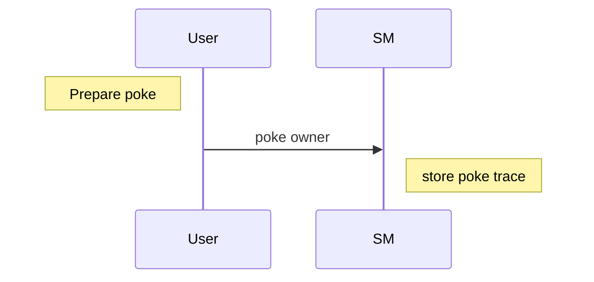

# Training dapp n°1

# :point_up: Poke game

> dapp : A decentralized application (dApp) is a type of distributed open source software application that runs on a peer-to-peer (P2P) blockchain network rather than on a single computer. DApps are visibly similar to other software applications that are supported on a website or mobile device but are P2P supported

We are creating a poke game on smart contract. You will learn :

- create a Tezos project with taqueria
- create a smart contract in jsligo
- deploy the smart contract to a local testnet and a real testnet
- create a dapp using taquito library and interact with a Tezos browser wallet
- use an indexer

> :warning: This is not an HTML or REACT training, I will avoid as much of possible any complexity relative to these technologies

The game consists on poking the owner of a smart contract. The smartcontract keeps a track of user interactions and stores this trace.

Poke sequence diagram



# :memo: Prerequisites

Please install this software first on your machine or use online alternative :

- [ ] [VS Code](https://code.visualstudio.com/download) : as text editor
- [ ] [npm](https://nodejs.org/en/download/) : we will use a typescript React client app
- [ ] [yarn](https://classic.yarnpkg.com/lang/en/docs/install/#windows-stable) : because yet another package manager (https://www.geeksforgeeks.org/difference-between-npm-and-yarn/)
- [ ] [taqueria v0.43.0](https://github.com/ecadlabs/taqueria) : Tezos Dapp project tooling
- [ ] [taqueria VS Code extension](https://marketplace.visualstudio.com/items?itemName=ecadlabs.taqueria-vscode) : visualize your project and execute tasks
- [ ] [ligo VS Code extension](https://marketplace.visualstudio.com/items?itemName=ligolang-publish.ligo-vscode) : for smart contract highlighting, completion, etc ..
- [ ] [Temple wallet](https://templewallet.com/) : an easy to use Tezos wallet in your browser (but you can take any other one that supports ghostnet)
- [ ] [Docker](https://docs.docker.com/engine/install/) Taqueria requires Docker images to run Ligo and other plugins ... :whale2:

# :scroll: Smart contract

## Step 1 : Create folder & file

> Note : We will use CLI here but you can also use GUI from the IDE or Taqueria plugin

```bash
taq init training
cd training
taq install @taqueria/plugin-ligo
taq create contract pokeGame.jsligo
```

## Step 2 : Edit pokeGame.jsligo

Remove the default code and paste this code instead

```ligolang
export type storage = unit;

type return_ = [list<operation>, storage];

@entry
const poke = (_: unit, store: storage): return_ => {
  return [list([]) as list<operation>, store];
};
```

Every contract requires to respect this convention :

- at least one entrypoint, annotated with **@entry** , with a mandatory signature taking 2 arguments **\*(parameter, storage)** and a return type. An entrypoint is function that is exposed as an external API.
- **parameter** : the entrypoint `parameter`. It can be whatever type but it is mandatory. For example : variable `_` (i.e we don't really need it here) and of type `unit` (the default type on Ligo)
- **storage** : the on-chain storage. It can be of any type but it is mandatory. For example : `unit` by default. We encourage you to add an `export` keyword before the type definition as it is a good practice to export it when you will require to write unit tests from another Ligo file.
- **return\_** : a list of `operation` and a storage. This is mandatory types by convention. You can only define another variable name, that is not a keyword, if you want

> [Have a look on the Entrypoints contracts documentation](https://ligolang.org/docs/advanced/entrypoints-contracts)>

> Note : The old syntax was requiring a main function. It is still valid but very verbatim and will be deprecated.
>
> A `Poke` variant parameter will be generated from the `poke` entrypoint function under the hood. A variant is more or less equivalent of the Enum type in Javascript. Also a default main function will be generated and will like as a big dispatch for each of your entrypoints. It means that this painful boilerplate is no more needed on the new syntax

> [Have a look on the Variant type documentation](https://ligolang.org/docs/language-basics/unit-option-pattern-matching#variant-types)

## Step 3 : Write the poke function

We want to store every user/caller addresses poking the contract.
Rewrite the storage, and add the caller address to the set of poke people

At line 1, replace the line with :

```ligolang
export type storage = set<address>;
```

Replace the `poke` function with :

```ligolang
@entry
const poke = (_: unit, store: storage): return_ => {
  return [list([]) as list<operation>, Set.add(Tezos.get_source(), store)]
};
```

Explanation :

- The Ligo Set library has a function `add` to add one element to the Set items. There is no notion of Class in Ligo, you will manipulate library to apply action on objects
- We require to return a list of operation. As we don't need it right now we just can return an empty list. As you create a generic list you will need to explicitly help the compiler with `as list<operation>` casting

> [Have a look on the Set library documentation](https://ligolang.org/docs/language-basics/sets-lists-tuples#sets)

> [Have a look on the List library documentation](https://ligolang.org/docs/language-basics/sets-lists-tuples/?lang=jsligo#lists)

Here, we get the caller address using `Tezos.get_source()`. Tezos library provides useful functions for manipulating blockchain objects

> [Have a look on the Tezos library documentation](https://ligolang.org/docs/reference/current-reference)

## Step 4 : Try to poke

The Ligo command-line provides sub-commands to test your Ligo code

> [Have a look on the Testing Framework documentation](https://ligolang.org/docs/advanced/testing)

Compile the contract with Taqueria (Here we force to use specific a Ligo version with `TAQ_LIGO_IMAGE` environment variable as Taqueria will use a default hardcoded one depending of its version)

```bash
TAQ_LIGO_IMAGE=ligolang/ligo:1.1.0 taq compile pokeGame.jsligo
```

Taqueria is generating the `.tz` Michelson file on the `artifacts` folder. The Michelson language is the default stack language used by the Michelson VM to run your code on a node. It is something similar to WASM.

> [Have a look on the Michelson documentation](https://tezos.gitlab.io/active/michelson.html)

Taqueria will generate you two other files, edit the first file `pokeGame.storageList.jsligo` replacing current code with :

```ligolang
#import "pokeGame.jsligo" "Contract"

const default_storage = Set.empty as set<address>;
```

When you will deploy a contract, you will be required to initialize the default state of your smart contract. Taqueria offers you to declare different variables on this file, it will be usefull to use different initiliazed state per environment

[Have a look on the Taqueria documentation](https://taqueria.io/docs/plugins/plugin-ligo/#the-taq-compile-task)

Compile all (contract + initial storage)

```bash
TAQ_LIGO_IMAGE=ligolang/ligo:1.1.0 taq compile pokeGame.jsligo
```

It compiles both source code and storage now

Before deployment, to simulate a call to our entrypoint `poke`, we can use `taq simulate`.  
We will pass the contract parameter `Poke()` and the initial storage with the default empty set

Edit the second file `pokeGame.parameterList.jsligo`

```ligolang
#import "pokeGame.jsligo" "Contract"
const default_parameter: parameter_of Contract = Poke();
```

Run the simulation. First you install the Tezos client plugin, you recompile all and then run the simulation

```bash
taq install @taqueria/plugin-octez-client
TAQ_LIGO_IMAGE=ligolang/ligo:1.1.0 taq compile pokeGame.jsligo
taq simulate pokeGame.tz --param pokeGame.parameter.default_parameter.tz
```

Output should give :

```logs
┌─────────────┬──────────────────────────────────────────────┐
│ Contract    │ Result                                       │
├─────────────┼──────────────────────────────────────────────┤
│ pokeGame.tz │ storage                                      │
│             │   { "tz1Ke2h7sDdakHJQh8WX4Z372du1KChsksyU" } │
│             │ emitted operations                           │
│             │                                              │
│             │ big_map diff                                 │
│             │                                              │
│             │                                              │
└─────────────┴──────────────────────────────────────────────┘
```

You can notice that the instruction will store the address of the caller into the storage set

## Step 5 : Configure your wallet to get free Tez

### Local testnet

Taqueria uses Flextesa as a local testnet that includes already some accounts (alice,bob,...), so you don't really need to configure something. We will not use the local testnet, instead we will deploy directly a real testnet environment , the `ghostnet`. It can profit there of free indexer services

### Ghostnet testnet

:warning: You need an account to deploy a contract with some `tez` (the Tezos native currency). The first time you deploy a contract with Taqueria, it will generate a new implicit account with `0 tez`

Install the taquito plugin and deploy your contract to the `testing` environment, it will force Taqueria to generate this default account

```bash
taq install @taqueria/plugin-taquito
taq deploy pokeGame.tz -e "testing"
```

You should get this kind of log

```log
Warning: the faucet field in network configs has been deprecated and will be ignored
A keypair with public key hash tz1XXXXXXXXXXXXXXXXXXXXXX was generated for you.
To fund this account:
1. Go to https://teztnets.xyz and click "Faucet" of the target testnet
2. Copy and paste the above key into the 'wallet address field
3. Request some Tez (Note that you might need to wait for a few seconds for the network to register the funds)
No operations performed
```

#### Choice 1 (Recommended) : Use alice wallet instead of generated account

A common usage is to use `alice` account as taqueria operator. `alice` is a common known address used on Tezos and she has always some `tez`

Replace the Taqueria config file for `testing` env `.taq/config.local.testing.json` with `alice` settings:

```json
{
  "networkName": "ghostnet",
  "accounts": {
    "taqOperatorAccount": {
      "publicKey": "edpkvGfYw3LyB1UcCahKQk4rF2tvbMUk8GFiTuMjL75uGXrpvKXhjn",
      "publicKeyHash": "tz1VSUr8wwNhLAzempoch5d6hLRiTh8Cjcjb",
      "privateKey": "edsk3QoqBuvdamxouPhin7swCvkQNgq4jP5KZPbwWNnwdZpSpJiEbq"
    }
  }
}
```

#### Choice 2 : use the Taqueria generated account instead

Copy the account `privateKey` on the `.taq/config.local.testing.json` config file

#### Configure Temple wallet

Open your Temple browser extension on your computer or on your mobile phone and do the [initial setup](https://www.youtube.com/watch?v=S8_tL8PfCts)
Once you are done, go to Settings (click on the avatar icon, or display Temple in full page) and click on `Import account > Private key` tab

Paste the `privateKey` to Temple text input and confirm

#### Send free Tez to your new account (optional)

If you don't `Tez`, go to a web faucet like [Marigold faucet here](https://faucet.marigold.dev/).
Connect your wallet on `Ghostnet` and ask for free `tez`

Now you have :moneybag: !!!

## Step 6 : Deploy to Ghostnet testnet

Retry to deploy to the testing environment

```bash
taq deploy pokeGame.tz -e "testing"
```

HOORAY :confetti_ball: your smart contract is ready on the Ghostnet !

```logs
┌─────────────┬──────────────────────────────────────┬──────────┬──────────────────┬────────────────────────────────┐
│ Contract    │ Address                              │ Alias    │ Balance In Mutez │ Destination                    │
├─────────────┼──────────────────────────────────────┼──────────┼──────────────────┼────────────────────────────────┤
│ pokeGame.tz │ KT1G8tx4qSeJmKRY1p2oxA6eYoCGc9Qi3Fky │ pokeGame │ 0                │ https://ghostnet.ecadinfra.com │
└─────────────┴──────────────────────────────────────┴──────────┴──────────────────┴────────────────────────────────┘
```

# :construction_worker: Dapp

## Step 1 : Create a react app

```bash
yarn create vite
```

Then follow the prompts. Choose React and then Typescript:

```shell
? Project name: › app #Enter your project name

? Select a framework: › - Use arrow-keys. Return to submit. #We select React as framework
    Vanilla
    Vue
❯   React
    Preact
    Lit
    Svelte
    Others

? Select a variant: › - Use arrow-keys. Return to submit. #Both TypeScript variants are fine. We select TypeScript only.
    TypeScript
❯   TypeScript + SWC
    JavaScript
    JavaScript + SWC

cd app
```

Learining SWC is not part of this tutorial but you can read about it here [SWC](https://swc.rs/).

Add taquito and tzkt indexer lib

```bash
yarn add @taquito/taquito @taquito/beacon-wallet @airgap/beacon-sdk  @tzkt/sdk-api
yarn add -D @airgap/beacon-types
```

> :warning: :warning: :warning: Before we start we need to add the following dependencies in order to not get polyfill issues. The reason for this step is that certain required dependencies are Node APIs, thus not included in Browsers. But it is still needed for communication and interaction with Wallets and Smart Contracts.

> For example, in my case, I installed this :
>
> ```bash
> yarn add --dev process buffer crypto-browserify stream-browserify assert stream-http https-browserify os-browserify url path-browserify
> ```
>
> Create a new file `nodeSpecific.ts` in the src folder of your project and edit with this content :
>
> ```bash
> touch src/nodeSpecific.ts
> ```
>
> ```js
> import { Buffer } from "buffer";
>
> globalThis.Buffer = Buffer;
> ```
>
> Open the `index.html` file and replace the `body` with this one :
>
> ```html
> <body>
>   <div id="root"></div>
>   <script type="module" src="/src/nodeSpecific.ts"></script>
>   <script type="module" src="/src/main.tsx"></script>
> </body>
> ```
>
> Finally open the `vite.config.ts` file and replace it with :
>
> ```js
> import react from "@vitejs/plugin-react-swc";
> import path from "path";
> import { defineConfig } from "vite";
> // https://vitejs.dev/config/
> export default ({ command }) => {
>   const isBuild = command === "build";
>
>   return defineConfig({
>     define: {},
>     plugins: [react()],
>     build: {
>       commonjsOptions: {
>         transformMixedEsModules: true,
>       },
>     },
>     resolve: {
>       alias: {
>         // dedupe @airgap/beacon-sdk
>         // I almost have no idea why it needs `cjs` on dev and `esm` on build, but this is how it works 🤷‍♂️
>         "@airgap/beacon-sdk": path.resolve(
>           path.resolve(),
>           `./node_modules/@airgap/beacon-sdk/dist/${
>             isBuild ? "esm" : "cjs"
>           }/index.js`
>         ),
>         stream: "stream-browserify",
>         os: "os-browserify/browser",
>         util: "util",
>         process: "process/browser",
>         buffer: "buffer",
>         crypto: "crypto-browserify",
>         assert: "assert",
>         http: "stream-http",
>         https: "https-browserify",
>         url: "url",
>         path: "path-browserify",
>       },
>     },
>   });
> };
> ```

### Generate Typescript classes from Michelson code

Taqueria is able to generate Typescript classes for our React application. It will take the definition of your smart contract and will generate the contract entrypoint functions, type definitions, etc ...

To get typescript classes from taqueria plugin, you need to be `on your project root folder` and run :

```bash
taq install @taqueria/plugin-contract-types
taq generate types ./app/src
```

Now, back to your frontend app, and run the dev server

```bash
cd app
yarn dev
```

Open your browser at : http://localhost:5173/
Your app should be running

## Step 2 : Connect / disconnect the wallet

We will declare two React Button components and display the user address and his balance

Edit `src/App.tsx` file

```typescript
import { NetworkType } from "@airgap/beacon-types";
import { BeaconWallet } from "@taquito/beacon-wallet";
import { TezosToolkit } from "@taquito/taquito";
import * as api from "@tzkt/sdk-api";
import { useEffect, useState } from "react";
import "./App.css";
import ConnectButton from "./ConnectWallet";
import DisconnectButton from "./DisconnectWallet";

function App() {
  api.defaults.baseUrl = "https://api.ghostnet.tzkt.io";

  const Tezos = new TezosToolkit("https://ghostnet.tezos.marigold.dev");
  const wallet = new BeaconWallet({
    name: "Training",
    preferredNetwork: NetworkType.GHOSTNET,
  });
  Tezos.setWalletProvider(wallet);

  useEffect(() => {
    (async () => {
      const activeAccount = await wallet.client.getActiveAccount();
      if (activeAccount) {
        setUserAddress(activeAccount.address);
        const balance = await Tezos.tz.getBalance(activeAccount.address);
        setUserBalance(balance.toNumber());
      }
    })();
  }, []);

  const [userAddress, setUserAddress] = useState<string>("");
  const [userBalance, setUserBalance] = useState<number>(0);

  return (
    <div className="App">
      <header className="App-header">
        <ConnectButton
          Tezos={Tezos}
          setUserAddress={setUserAddress}
          setUserBalance={setUserBalance}
          wallet={wallet}
        />

        <DisconnectButton
          wallet={wallet}
          setUserAddress={setUserAddress}
          setUserBalance={setUserBalance}
        />

        <div>
          I am {userAddress} with {userBalance} mutez
        </div>
      </header>
    </div>
  );
}

export default App;
```

Let's create the 2 missing src component files and put code in it. Create these files :

```bash
touch src/ConnectWallet.tsx
touch src/DisconnectWallet.tsx
```

ConnectWallet button will create an instance wallet, get user permissions via a popup and then retrieve account information

Edit `ConnectWallet.tsx`

```typescript
import { NetworkType } from "@airgap/beacon-sdk";
import { BeaconWallet } from "@taquito/beacon-wallet";
import { TezosToolkit } from "@taquito/taquito";
import { Dispatch, SetStateAction } from "react";

type ButtonProps = {
  Tezos: TezosToolkit;
  setUserAddress: Dispatch<SetStateAction<string>>;
  setUserBalance: Dispatch<SetStateAction<number>>;
  wallet: BeaconWallet;
};

const ConnectButton = ({
  Tezos,
  setUserAddress,
  setUserBalance,
  wallet,
}: ButtonProps): JSX.Element => {
  const connectWallet = async (): Promise<void> => {
    try {
      await wallet.requestPermissions({
        network: {
          type: NetworkType.GHOSTNET,
          rpcUrl: "https://ghostnet.tezos.marigold.dev",
        },
      });
      // gets user's address
      const userAddress = await wallet.getPKH();
      const balance = await Tezos.tz.getBalance(userAddress);
      setUserBalance(balance.toNumber());
      setUserAddress(userAddress);
    } catch (error) {
      console.log(error);
    }
  };

  return (
    <div className="buttons">
      <button className="button" onClick={connectWallet}>
        <span>
          <i className="fas fa-wallet"></i>&nbsp; Connect with wallet
        </span>
      </button>
    </div>
  );
};

export default ConnectButton;
```

Edit `DisconnectWallet.tsx`.
The button will clean wallet instance and all linked objects

```typescript
import { BeaconWallet } from "@taquito/beacon-wallet";
import { Dispatch, SetStateAction } from "react";

interface ButtonProps {
  wallet: BeaconWallet;
  setUserAddress: Dispatch<SetStateAction<string>>;
  setUserBalance: Dispatch<SetStateAction<number>>;
}

const DisconnectButton = ({
  wallet,
  setUserAddress,
  setUserBalance,
}: ButtonProps): JSX.Element => {
  const disconnectWallet = async (): Promise<void> => {
    setUserAddress("");
    setUserBalance(0);
    console.log("disconnecting wallet");
    await wallet.clearActiveAccount();
  };

  return (
    <div className="buttons">
      <button className="button" onClick={disconnectWallet}>
        <i className="fas fa-times"></i>&nbsp; Disconnect wallet
      </button>
    </div>
  );
};

export default DisconnectButton;
```

Save both file, the dev server should refresh the page

As Temple is configured well, Click on Connect button

On the popup, select your Temple wallet, then your account and connect.


:confetti_ball: your are "logged"

Click on the Disconnect button (if you want to test it too)

## Step 3 : List poke contracts via an indexer

Remember that you deployed your contract previously.
Instead of querying heavily the rpc node to search where are located all similar contracts and get back each address, we can use an indexer. We can consider it as an enriched cache API on top of rpc node. In this example, we will use the tzkt indexer to find other similar contracts.

You need to install jq to parse the Taqueria json config file
[Install jq](https://github.com/stedolan/jq)

On `package.json`, change the `dev` command on `scripts` configuration. Prefix with `jq` command to create an new env var pointing to your last smart contract address on testing env :

```bash
    "dev": "jq -r '\"VITE_CONTRACT_ADDRESS=\" + last(.tasks[]).output[0].address' ../.taq/testing-state.json > .env && vite",
```

You are pointing now to the last contract deployed on Ghostnet by taqueria

We will add a button to fetch all similar contracts to the one you deployed, then we display the list

Now, edit `App.tsx` , before the `return` of the html template , add this section for the fetch function

```typescript
const [contracts, setContracts] = useState<Array<api.Contract>>([]);

const fetchContracts = () => {
  (async () => {
    setContracts(
      await api.contractsGetSimilar(import.meta.env.VITE_CONTRACT_ADDRESS, {
        includeStorage: true,
        sort: { desc: "id" },
      })
    );
  })();
};
```

On the return `html template` section, after the display of the user balance div `I am {userAddress} with {userBalance} mutez`, add this :

```tsx
<br />
<div>
  <button onClick={fetchContracts}>Fetch contracts</button>
  {contracts.map((contract) =>
  <div>{contract.address}</div>
  )}
</div>
```

Save your file, restart your server , it will generate the .env file containing the last deployed contracts :)

```bash
yarn dev
```

Go to the browser. click on `Fetch contracts` button


:confetti_ball: Congrats ! you are able to list all similar deployed contracts

## Step 4 : Poke your contract

Add this import to get the Taqueria generated types from your smar contract

```typescript
import { PokeGameWalletType } from "./pokeGame.types";
```

Add this new function after the previous fetch function, it will call the entrypoint for poking

```typescript
const poke = async (contract: api.Contract) => {
  let c: PokeGameWalletType = await Tezos.wallet.at<PokeGameWalletType>(
    "" + contract.address
  );
  try {
    const op = await c.methods.default().send();
    await op.confirmation();
    alert("Tx done");
  } catch (error: any) {
    console.table(`Error: ${JSON.stringify(error, null, 2)}`);
  }
};
```

> :warning: Normally we should call `c.methods.poke()` function , but with a unique entrypoint, Michelson generates an unique `default` entrypoint name instead of having the name of the entrypoint function. Also be careful because all entrypoints naming are converting to lowercase whatever variant variable name you can have on source file.

Replace the line displaying the contract address `{contracts.map((contract) => <div>{contract.address}</div>)}` with the one below. It will add a Poke button

```html
    {contracts.map((contract) => <div>{contract.address} <button onClick={() =>poke(contract)}>Poke</button></div>)}
```

Save and see the page refreshed, then click on Poke button


:confetti_ball: If you have enough Tez on your wallet to pay the gas, then it should have successfully call the contract and added you to the list of poke guyz

## Step 5 : Display poke guys

To verify that on the page, we can display the list of poke guyz directly on the page

Replace again the html previous line `{contracts ...}` with this one

```html
<table><thead><tr><th>address</th><th>people</th><th>action</th></tr></thead><tbody>
    {contracts.map((contract) => <tr><td style={{borderStyle: "dotted"}}>{contract.address}</td><td style={{borderStyle: "dotted"}}>{contract.storage.join(", ")}</td><td style={{borderStyle: "dotted"}}><button onClick={() =>poke(contract)}>Poke</button></td></tr>)}
    </tbody></table>
```

Contracts are displaying its people now


> :information_source: Wait around few second for blockchain confirmation and click on `fetch contracts` to refresh the list

:confetti_ball: Congratulation, you have completed this first dapp training

# :palm_tree: Conclusion :sun_with_face:

Now, you are able to create any Smart Contract using Ligo and create a complete Dapp via Taqueria/Taquito.

On next training, you will learn how to call a Smart contract inside a Smart Contract and use the callback, write unit test, etc ...

[:arrow_right: NEXT (HTML version)](https://marigold-dev.github.io/training-dapp-2)

[:arrow_right: NEXT (Github version)](https://github.com/marigold-dev/training-dapp-2)
