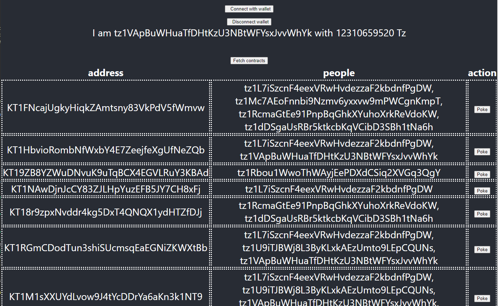

Training dapp n°1
===

# :point_up:  Poke game

> dapp : A decentralized application (dApp) is a type of distributed open source software application that runs on a peer-to-peer (P2P) blockchain network rather than on a single computer. DApps are visibly similar to other software applications that are supported on a website or mobile device but are P2P supported

We are creating a poke game on smart contract. You will learn :
- create a Tezos project with taqueria
- create a smart contract in jsligo
- deploy the smart contract to a local testnet and a real testnet
- create a dapp using taquito library and interact with a Tezos browser wallet
- use an indexer

> :warning: This is not an HTML or REACT training, I will avoid as much of possible any complexity relative to these technologies 

The game consists on poking the owner of a smart contract. The smartcontract keeps a track of user interactions and stores this trace.

Poke sequence diagram


# :memo: Prerequisites

Please install this software first on your machine or use online alternative : 

- [ ] [VS Code](https://code.visualstudio.com/download) : as text editor
- [ ] [npm](https://nodejs.org/en/download/) : we will use a typescript React client app
- [ ] [yarn](https://classic.yarnpkg.com/lang/en/docs/install/#windows-stable) : because yet another package manager (https://www.geeksforgeeks.org/difference-between-npm-and-yarn/)
- [ ] [taqueria](https://github.com/ecadlabs/taqueria) : Tezos Dapp project tooling
- [ ] [taqueria VS Code extension](https://marketplace.visualstudio.com/items?itemName=ecadlabs.taqueria-vscode) : visualize your project and execute tasks
- [ ] [ligo VS Code extension](https://marketplace.visualstudio.com/items?itemName=ligolang-publish.ligo-vscode) : for smart contract highlighting, completion, etc ..
- [ ] [Temple wallet](https://templewallet.com/) : an easy to use Tezos wallet in your browser

> :warning: :whale: About Taqueria : taqueria is using software images from Docker to run Ligo, etc ... Docker should be running on your machine :whale2:

# :scroll: Smart contract

## Step 1 : Create folder & file

> Note : We will use CLI here but you can also use GUI from the IDE or Taqueria plugin 

```bash
taq init training1
cd training1
taq install @taqueria/plugin-ligo
taq create contract pokeGame.jsligo
```

## Step 2 : Edit pokeGame.jsligo

Remove the default code and paste this code instead

```typescript 
type storage = unit;

type parameter =
| ["Poke"];

type return_ = [list<operation>, storage];

const main = ([action, store] : [parameter, storage]) : return_ => {
    return match (action, {
        Poke: () => poke(store)
    } 
    )
};
```

Every contract requires to respect this convention :
- an entrypoint, **main** by default, with a mandatory signature taking 2 parameters and a return : 
    - **parameter** : the contract `parameter`
    - **storage** : the on-chain storage (can be any type, here `unit` by default)
    - **return_** : a list of `operation` and a storage

> Doc :  https://ligolang.org/docs/advanced/entrypoints-contracts

Pattern matching is an important feature in Ligo. We need a switch on the entrypoint function to manage different actions. We use `match` to evaluate the parameter and call the appropriate `poke` function
> Doc https://ligolang.org/docs/language-basics/unit-option-pattern-matching

```javascript
match (action, {
        Poke: () => poke(store)
    } 
```

`Poke` is a `parameter` from `variant` type. It is a bit equivalent of Enum type in javascript

```javascript
type parameter =
| ["Poke"];
```

> Doc https://ligolang.org/docs/language-basics/unit-option-pattern-matching#variant-types

## Step 3 : Write the poke function

We want to store every caller address poking the contract. Let's redefine storage, and then add the caller to the set of poke guys

At line 1, replace :

```typescript
type storage = set<address>;
```

Before main function, add : 

```typescript
const poke = (store : storage) : return_ => {
    return [  list([]) as list<operation>, Set.add(Tezos.get_source(), store)]; 
};
```

Set library has specific usage :
> Doc https://ligolang.org/docs/language-basics/sets-lists-tuples#sets


Here, we get the caller address using `Tezos.get_source()`. Tezos library provides useful function for manipulating blockchain objects
> Doc https://ligolang.org/docs/reference/current-reference

## Step 4 : Try to poke

The LIGO command-line interpreter provides sub-commands to directly test your LIGO code

> Doc : https://ligolang.org/docs/advanced/testing

Compile contract (to check any error, and prepare the michelson outputfile to deploy later) :

```bash
taq compile pokeGame.jsligo
```

Taqueria is creating the Michelson file output on `artifacts` folder

Compile an initial storage with taqueria. Your file should have this pattern `<MY_SOURCE_CODE>.storages.*ligo`

```bash
taq create contract pokeGame.storages.jsligo
```

Replace current code by 

```typescript
#include "pokeGame.jsligo"
const default_storage = Set.empty as set<address>;
```

Compile all now

```bash
taq compile pokeGame.jsligo
```

It compiles both source code and storage now. (You can also pass an argument -e to change the environment target for your storage initialization)

Let's simulate the Poke call using `taq simulate`  
We will pass the contract parameter `Poke()` and the initial on-chain storage with an empty set

```bash
taq install @taqueria/plugin-tezos-client
taq create contract pokeGame.parameters.jsligo
```

Edit the file

```typescript
#include "pokeGame.jsligo"
const default_parameter = Poke();
```

Run simulation now

```bash
taq compile pokeGame.jsligo
taq simulate pokeGame.tz --param pokeGame.parameter.default_parameter.tz  
```

Output should give :

```logs
┌─────────────┬──────────────────────────────────────────────┐
│ Contract    │ Result                                       │
├─────────────┼──────────────────────────────────────────────┤
│ pokeGame.tz │ storage                                      │
│             │   { "KT1BEqzn5Wx8uJrZNvuS9DVHmLvG9td3fDLi" } │
│             │ emitted operations                           │
│             │                                              │
│             │ big_map diff                                 │
│             │                                              │
│             │                                              │
└─────────────┴──────────────────────────────────────────────┘
```

You can notice that the instruction will store the address of the caller into the traces storage

## Step 5 : Configure your wallet to get free Tez

### Local testnet wallet

Flextesa local testnet includes already some accounts with XTZ (alice,bob,...), so you don't really need to

### Ghostnet testnet wallet

> Note as a simple user, you would need only a web faucet like [Marigold faucet here](https://faucet.marigold.dev/). However, Taqueria will require the faucet JSON file to execute commands

Go to the [Tezos faucet](https://teztnets.xyz/ghostnet-about) and get the faucet file for Ghostnet

On taqueria .taq/config.json file, add the Ghostnet testnet on network field as follow : 

```json
{
...


   "network": {
        "ghostnet": {
            "label": "ghostnet",
            "rpcUrl": "https://ghostnet.tezos.marigold.dev",
            "protocol": "PtKathmankSpLLDALzWw7CGD2j2MtyveTwboEYokqUCP4a1LxMg",
            "faucet": {
                "pkh": "tz1Qjvu8xaRgTjQmHBBDHaM1HGomCTYBgLZJ",
                "mnemonic": [
                    "away",
                    "virus",
                    "stand",
                    "kingdom",
                    "sorry",
                    "absurd",
                    "close",
                    "found",
                    "warrior",
                    "icon",
                    "nominee",
                    "theme",
                    "enough",
                    "kiss",
                    "double"
                ],
                "email": "mpyuqqza.jqszvrsy@teztnets.xyz",
                "password": "9OvRmgifTP",
                "amount": "17415095578",
                "activation_code": "8e54d45a59d21089fc60c6d4e94ecf4ecc44c417"
            }
        }
    },


...
}    
```

Then on "environment" field, you can add a new environment pointing to this network

```json
...


"environment": {
...

        ,
        "testing": {
            "networks": [
                "ghostnet"
            ],
            "sandboxes": [],
            "storage": {},
            "aliases": {}
        }

...
```

Your account should appear on the list now with its balance

### Temple

Open your Temple browser extension or on your mobile phone. Do the initial setup to create an implicit account then import an account from the previous JSON faucet file

:rocket: You are ready to go :sunglasses:

## Step 6 : (Optional) deploy locally with flextesa

You can deploy locally Tezos on your local machine, but we require to use later an indexer (this service exists already on Jakartanet). For your knowledge, below the step to deploy locally. Also you can change some parameter to point to another protocol version

```
taq install @taqueria/plugin-flextesa

# it takes some minutes the first time
taq start sandbox local

#list users
taq list accounts local

```

Deploy the contract on `development` environment

You need to install taquito plugin first to originate the contract

```bash
taq install @taqueria/plugin-taquito

taq deploy pokeGame.tz -e "development" 
```

## Step 6 : Deploy to Ghostnet testnet


Deploy to testing env

```bash
taq install @taqueria/plugin-taquito

taq deploy pokeGame.tz -e "testing" 
```

HOORAY :confetti_ball: your smart contract is ready on the Ghostnet !

# :construction_worker:  Dapp 

## Step 1 : Create react app

```bash
yarn create react-app app --template typescript

cd app
```

Add taquito, tzkt indexer lib

```bash
yarn add @taquito/taquito @taquito/beacon-wallet @airgap/beacon-sdk 
yarn add -D @airgap/beacon-types
yarn add @dipdup/tzkt-api
```

> :warning: If you are using last version 5.x of react-script, follow these steps to rewire webpack for all encountered missing libraries : https://github.com/ChainSafe/web3.js#troubleshooting-and-known-issues

> For example, in my case, I install this :
> ```bash
> yarn add --dev react-app-rewired process crypto-browserify stream-browserify assert stream-http https-browserify os-browserify url path-browserify
> ```
> and my override file is : 
> ```json
> const webpack = require('webpack');
>
>module.exports = function override(config) {
>    const fallback = config.resolve.fallback || {};
>    Object.assign(fallback, {
>        "crypto": require.resolve("crypto-browserify"),
>        "stream": require.resolve("stream-browserify"),
>        "assert": require.resolve("assert"),
>        "http": require.resolve("stream-http"),
>        "https": require.resolve("https-browserify"),
>        "os": require.resolve("os-browserify"),
>        "url": require.resolve("url"),
>        "path": require.resolve("path-browserify") 
>    })
>    config.ignoreWarnings = [/Failed to parse source map/];
>    config.resolve.fallback = fallback;
>    config.plugins = (config.plugins || []).concat([
>        new webpack.ProvidePlugin({
>            process: 'process/browser',
>            Buffer: ['buffer', 'Buffer']
>        })
>    ])
>    return config;
>}   
> ```
> then I change the script in package.json by
> "scripts": {
>    "start": "react-app-rewired start",
>    "build": "react-app-rewired build",
>    "test": "react-app-rewired test",
>    "eject": "react-scripts eject"
>},
> :warning:

### Generate Typescript classes from Michelson code

Get typescript classes from taqueria plugin, get back to root folder

```bash
cd ..

taq install @taqueria/plugin-contract-types

taq generate types ./app/src

cd ./app
```

Start the dev server

```bash
yarn run start
```

Open your browser at : http://localhost:3000/
Your app should be running

## Step 2 : Connect / disconnect the wallet

We will declare 2 React Button components and a display of address and balance while connected

Edit src/App.tsx file

```typescript
import { useState } from 'react';
import './App.css';
import ConnectButton from './ConnectWallet';
import { TezosToolkit } from '@taquito/taquito';
import DisconnectButton from './DisconnectWallet';

function App() {

  const [Tezos, setTezos] = useState<TezosToolkit>(new TezosToolkit("https://ghostnet.tezos.marigold.dev"));
  const [wallet, setWallet] = useState<any>(null);
  const [userAddress, setUserAddress] = useState<string>("");
  const [userBalance, setUserBalance] = useState<number>(0);

  return (
    <div className="App">
      <header className="App-header">
        
        <ConnectButton
          Tezos={Tezos}
          setWallet={setWallet}
          setUserAddress={setUserAddress}
          setUserBalance={setUserBalance}
          wallet={wallet}
        />
        
        <DisconnectButton
          wallet={wallet}
          setUserAddress={setUserAddress}
          setUserBalance={setUserBalance}
          setWallet={setWallet}
        />

        <div>
        I am {userAddress} with {userBalance} mutez
        </div>

      </header>
    </div>
  );
}

export default App;
```

Let's create the 2 missing src component files and put code in it. On **src** folder, create these files.

```bash
touch ConnectWallet.tsx
touch DisconnectWallet.tsx
```

ConnectWallet button will create an instance wallet, get user permissions via a popup and then retrieve account information

Edit ConnectWallet.tsx

```typescript
import { Dispatch, SetStateAction, useState, useEffect } from "react";
import { TezosToolkit } from "@taquito/taquito";
import { BeaconWallet } from "@taquito/beacon-wallet";
import {
  NetworkType
} from "@airgap/beacon-sdk";

type ButtonProps = {
  Tezos: TezosToolkit;
  setWallet: Dispatch<SetStateAction<any>>;
  setUserAddress: Dispatch<SetStateAction<string>>;
  setUserBalance: Dispatch<SetStateAction<number>>;
  wallet: BeaconWallet;
};

const ConnectButton = ({
  Tezos,
  setWallet,
  setUserAddress,
  setUserBalance,
  wallet
}: ButtonProps): JSX.Element => {

  const setup = async (userAddress: string): Promise<void> => {
    setUserAddress(userAddress);
    // updates balance
    const balance = await Tezos.tz.getBalance(userAddress);
    setUserBalance(balance.toNumber());
  };

  const connectWallet = async (): Promise<void> => {
    try {
      if(!wallet) await createWallet();
      await wallet.requestPermissions({
        network: {
          type: NetworkType.GHOSTNET,
          rpcUrl: "https://ghostnet.tezos.marigold.dev"
        }
      });
      // gets user's address
      const userAddress = await wallet.getPKH();
      await setup(userAddress);
    } catch (error) {
      console.log(error);
    }
  };

  const createWallet = async() => {
    // creates a wallet instance if not exists
    if(!wallet){
      wallet = new BeaconWallet({
      name: "training",
      preferredNetwork: NetworkType.GHOSTNET
    });}
    Tezos.setWalletProvider(wallet);
    setWallet(wallet);
    // checks if wallet was connected before
    const activeAccount = await wallet.client.getActiveAccount();
    if (activeAccount) {
      const userAddress = await wallet.getPKH();
      await setup(userAddress);
    }
  }

  useEffect(() => {
    (async () => createWallet())();
  }, []);

  return (
    <div className="buttons">
      <button className="button" onClick={connectWallet}>
        <span>
          <i className="fas fa-wallet"></i>&nbsp; Connect with wallet
        </span>
      </button>
    </div>
  );
};

export default ConnectButton;
```

DisconnectWallet button will clean wallet instance and all linked objects

```typescript
import { Dispatch, SetStateAction } from "react";
import { BeaconWallet } from "@taquito/beacon-wallet";

interface ButtonProps {
  wallet: BeaconWallet | null;
  setUserAddress: Dispatch<SetStateAction<string>>;
  setUserBalance: Dispatch<SetStateAction<number>>;
  setWallet: Dispatch<SetStateAction<any>>;
}

const DisconnectButton = ({
  wallet,
  setUserAddress,
  setUserBalance,
  setWallet,
}: ButtonProps): JSX.Element => {
  const disconnectWallet = async (): Promise<void> => {
    setUserAddress("");
    setUserBalance(0);
    setWallet(null);
    console.log("disconnecting wallet");
    if (wallet) {
      await wallet.client.removeAllAccounts();
      await wallet.client.removeAllPeers();
      await wallet.client.destroy();
    }
  };

  return (
    <div className="buttons">
      <button className="button" onClick={disconnectWallet}>
        <i className="fas fa-times"></i>&nbsp; Disconnect wallet
      </button>
    </div>
  );
};

export default DisconnectButton;

```

Save both file, the dev server should refresh the page

As Temple is configured well, Click on Connect button

On the popup, select your Temple wallet, then your account and connect. :warning: Do not forget to stay on the "ghostnet" testnet


:confetti_ball: your are *"logged"*

Click on the Disconnect button to logout to test it

## Step 3 : List poke contracts via an indexer

Remember that you deployed your contract previously.
Instead of querying heavily the rpc node to search where is located your contract and get back some information about it, we can use an indexer. We can consider it as an enriched cache API on top of rpc node. In this example, we will use the tzkt indexer

Add the library

```bash
yarn add @dipdup/tzkt-api dotenv
```


[Install jq](https://github.com/stedolan/jq)

On `package.json`, change the `start script` line, prefixing with `jq` command to create an new env var pointing to your last smart contract address on testing env :

```bash
    "start": "jq -r '\"REACT_APP_CONTRACT_ADDRESS=\" + last(.tasks[]).output[0].address' ../.taq/testing-state.json > .env && react-app-rewired start",
```

You are pointing now to the last contract deployed on Ghostnet by taqueria

We will add a button to fetch all similar contracts to the one you deployed, then we display the list

Now, edit App.tsx to add 1 import on top of the file

```typescript
import { Contract, ContractsService } from '@dipdup/tzkt-api';
```

Before the `return` , add this section for the fetch

```typescript
  const contractsService = new ContractsService( {baseUrl: "https://api.ghostnet.tzkt.io" , version : "", withCredentials : false});
  const [contracts, setContracts] = useState<Array<Contract>>([]);

  const fetchContracts = () => {
    (async () => {
     setContracts((await contractsService.getSimilar({address: process.env["REACT_APP_CONTRACT_ADDRESS"]!, includeStorage:true, sort:{desc:"id"}})));
    })();
  }
```

On the return 'html templating' section, add this after the display of the user balance div `I am {userAddress} with {userBalance} mutez`, add this : 

```html
<br />
<div>
    <button onClick={fetchContracts}>Fetch contracts</button>
    {contracts.map((contract) => <div>{contract.address}</div>)}
</div>
```

Save your file, and re-run your server , it will generate the .env file containing the last deployed contracts :)

```bash
yarn run start
```

Go to the browser. click on `Fetch contracts` button


:confetti_ball:  Congrats ! you are able to list all similar deployed contracts

## Step 4 : Poke your contract

Add this new function inside the App function, it will call the entrypoint to poke

```typescript
import { PokeGameWalletType } from './pokeGame.types';

...


  const poke = async (contract : Contract) => {   
    let c : PokeGameWalletType = await Tezos.wallet.at<PokeGameWalletType>(""+contract.address);
    try {
      const op = await c.methods.default().send();
      await op.confirmation();
      alert("Tx done");
    } catch (error : any) {
      console.table(`Error: ${JSON.stringify(error, null, 2)}`);
    }
  };
```

> :warning: Normally we should call `c.methods.poke()` function , but with a unique entrypoint, Michelson is required a unique `default` name instead of having the name of the function. Also be careful because all entrypoints naming are converting to lowercase whatever variant variable name you can have on source file.

Then replace the line displaying the contract address `{contracts.map((contract) => <div>{contract.address}</div>)}` by this one that will add a Poke button

```html
    {contracts.map((contract) => <div>{contract.address} <button onClick={() =>poke(contract)}>Poke</button></div>)}
```

> There is a Taqueria bug on unique entrypoint: https://github.com/ecadlabs/taqueria/issues/1128
> Go to ./app/src/pokeGame.types.ts and rewrite these lines
>
> ```typescript 
> type Methods = {
>     default : () => Promise<void>;
> };
> 
> type MethodsObject = {
>     default : () => Promise<void>;
> };
> ```

Save and see the page refreshed, then click on Poke button


:confetti_ball:  If you have enough Tz on your wallet for the gas, then it should have successfully call the contract and added you to the list of poke guyz

## Step 5 : Display poke guys

To verify that on the page, we can display the list of poke guyz directly on the page

Replace again the html contracts line by this one

```html
<table><thead><tr><th>address</th><th>people</th><th>action</th></tr></thead><tbody>
    {contracts.map((contract) => <tr><td style={{borderStyle: "dotted"}}>{contract.address}</td><td style={{borderStyle: "dotted"}}>{contract.storage.join(", ")}</td><td style={{borderStyle: "dotted"}}><button onClick={() =>poke(contract)}>Poke</button></td></tr>)}
    </tbody></table>
```

Contracts are displaying its people now



> :information_source: Wait around few second for blockchain confirmation and click on `fetch contracts` to refresh the list
 
:confetti_ball: Congratulation, you have completed this first dapp training

# :palm_tree: Conclusion :sun_with_face:

Now, you are able to create any Smart Contract using Ligo and create a complete Dapp via Taqueria/Taquito.

On next training, you will learn how to call a Smart contract inside a Smart Contract and use the callback, write unit test, etc ...

[:arrow_right: NEXT](https://github.com/marigold-dev/training-dapp-2)
